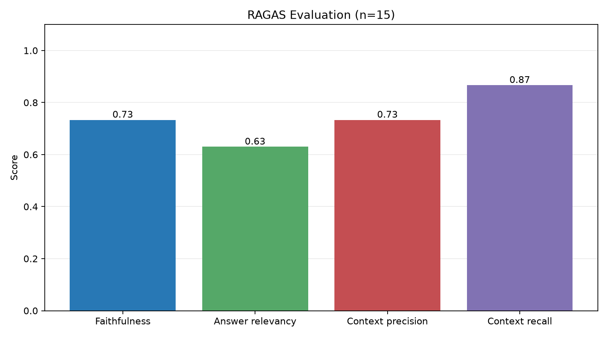

# RAG for Customer Support Tickets

An end-to-end Retrieval-Augmented Generation (RAG) system that answers questions from customer support tickets, evaluated with RAGAS.

Built as a personal learning project with LangChain, ChromaDB, Hugging Face embeddings, and an LLM served via Groq.

## Motivation

Support teams accumulate thousands of past tickets, but finding how a similar issue was handled usually means manual searching. This project explores whether a RAG system can retrieve relevant tickets and answer questions grounded only in that data, and measures how well it does so.

## Pipeline

```
Kaggle CSV → Cleaning (pandas) → Chunking → Embedding → ChromaDB
                                                          ↓
Query ─┬─ mentions a ticket ID? ── yes → Metadata filter (ticket_id)
       └─ otherwise ────────────── no  → Semantic retrieval (top-5)
                                                          ↓
              Answer (Groq LLM) ← Prompt ← Re-ranking → top-3 chunks
```

| Step | Implementation |
|---|---|
| Load & clean | pandas |
| Chunking | `RecursiveCharacterTextSplitter` (chunk size 400, overlap 50) |
| Embedding | `BAAI/bge-small-en-v1.5` via `HuggingFaceEmbeddings` |
| Vector store | ChromaDB (via LangChain) |
| Retrieval | Semantic top-5; metadata filter on `ticket_id` for ticket-lookup queries |
| Re-ranking | CrossEncoder `cross-encoder/ms-marco-MiniLM-L-6-v2`, keep top-3 |
| Prompt | LangChain `PromptTemplate` (answer only from context, with fallback response) |
| LLM | `[openai/gpt-oss-120b]` via `ChatGroq` (temperature 0) |
| Evaluation | RAGAS (judge: `[openai/gpt-oss-120b]`) |

## Evaluation (RAGAS)

15 Q&A pairs: 10 single-ticket lookups, 1 multi-ticket lookup, 1 semantic question, and 3 out-of-scope questions (the system should decline).



| Group | n | Faithfulness | Answer relevancy | Context precision | Context recall |
|---|---|---|---|---|---|
| Single-ticket lookup | 10 | 1.00 | 0.95 | 0.80 | 1.00 |
| Multi-ticket / semantic | 2 | 0.00 | 0.00 | 0.00 | 0.00 |
| Out-of-scope (should decline) | 3 | 0.33 | 0.00 | 1.00 | 1.00 |
| **Overall** | **15** | **0.73** | **0.63** | **0.73** | **0.87** |

Out-of-scope questions: 3/3 correctly declined with "I don't have enough information to answer that."

## LoRA Fine-tuning (small generator for the RAG system)

Fine-tuned `Qwen/Qwen2.5-0.5B-Instruct` with LoRA (r=16) using plain Hugging Face Transformers + PEFT (no LangChain) to act as the answer generator: answer ticket-lookup questions from the retrieved context in one sentence, and decline when the information is not there.

- Model: https://huggingface.co/mfatur/qwen2.5-0.5b-ticket-rag-lora
- Notebook: [`lora-finetuning/lora_rag_generator.ipynb`](lora-finetuning/lora_rag_generator.ipynb) (run on a free Colab GPU)
- Dataset builder: [`lora-finetuning/build_sft_dataset.py`](lora-finetuning/build_sft_dataset.py)

| Metric | Base | LoRA |
|---|---|---|
| Lookup value match (template test, n=400) | 0.47 | 1.00 |
| Out-of-scope refusal (template test, n=52) | 0.10 | 1.00 |
| Lookup value match (paraphrased, n=50) | 0.50 | 0.96 |
| Out-of-scope refusal (paraphrased, n=50) | 0.12 | 1.00 |

**Limitations**
- Training questions are generated from templates and target metadata fields in the ticket header, which is an easy task. The base model's lower scores partly reflect answer style and a 48-token output cap.
- Out-of-scope behavior was tested on only 5 unseen question types.
- Not yet tested: questions about free-text ticket descriptions, and end-to-end use in the RAG pipeline with real retrieved chunks.

### Findings

- Single-ticket lookups work well because of metadata filtering.
- The multi-ticket question failed: the ticket-ID regex captured only the first ID, so the second ticket was never retrieved. Planned fix: capture all ticket IDs in the query.
- The one semantic question failed: retrieval returned unrelated tickets. With only one such question, this is not enough to judge semantic retrieval in general.
- Context precision was 0.5 on four lookups: the header-only chunk was ranked above the chunk containing the actual description (likely re-ranker behavior, not yet verified).
- RAGAS scores correct refusals as 0 for answer relevancy, and faithfulness on identical fallback answers was inconsistent, so LLM-judge scores are noisy on these cases.

### Limitations

- Small sample (n=15) on a synthetic dataset, mostly ticket-lookup questions, so this set mainly tests the metadata-filter path, not open-ended semantic retrieval.
- If the judge model is the same as the generator, scores may be biased in its favor.

## Project Structure

```
RAG-llm/
├── rag-langchain/
│   ├── data/                  # raw and cleaned ticket CSVs
│   └── src/
│       ├── load_data.py       # load & clean data
│       ├── chunking.py
│       ├── embedding.py
│       ├── vectorDB.py        # build the Chroma vector store
│       ├── retrieval.py
│       ├── reranking.py
│       ├── prompt.py
│       ├── rag.py             # full RAG chain
│       └── test_groq.py       # quick Groq connectivity check
├── ragas-evaluation/
│   ├── dataset/               # evaluation Q&A pairs
│   ├── evaluation/
│   │   ├── generate_dataset.py
│   │   ├── evaluate_ragas.py
│   │   └── plot_ragas_result.py
│   └── results/               # scores, raw outputs, chart
└── requirements.txt
```

## Dataset

[Customer Support Ticket Dataset](https://www.kaggle.com/datasets/suraj520/customer-support-ticket-dataset/data) from Kaggle. This is a **synthetic** dataset (ticket descriptions contain unrelated filler sentences), so results may not transfer directly to real-world support data.

## Tech Stack

Python · LangChain · ChromaDB · Hugging Face (Sentence Transformers) · Groq · RAGAS · pandas